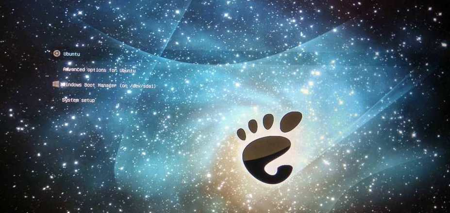

# Gnome Space GRUB theme

## Disclaimer:
- This theme is a work of [Andrew Shevchuk](https://github.com/shvchk)
- I forked this repository just to make slight modifications so as to modify the theme as I like. I claim **not to be the owner of the project** and that all the content belongs to [Andrew Shevchuk](https://github.com/shvchk).
- Link to original repository is [here](https://github.com/shvchk/poly-light).



### Installation / update

1. **Automatic way:**
    - Download install script:  
    `wget -P /tmp https://github.com/sarthakthakur24/poly-light/raw/master/install.sh`
    - Review install script at `/tmp/install.sh`
    - Run it: `bash /tmp/install.sh`
2. **Manual way:**
    - Clone this repository
    ```
    git clone 
    ```